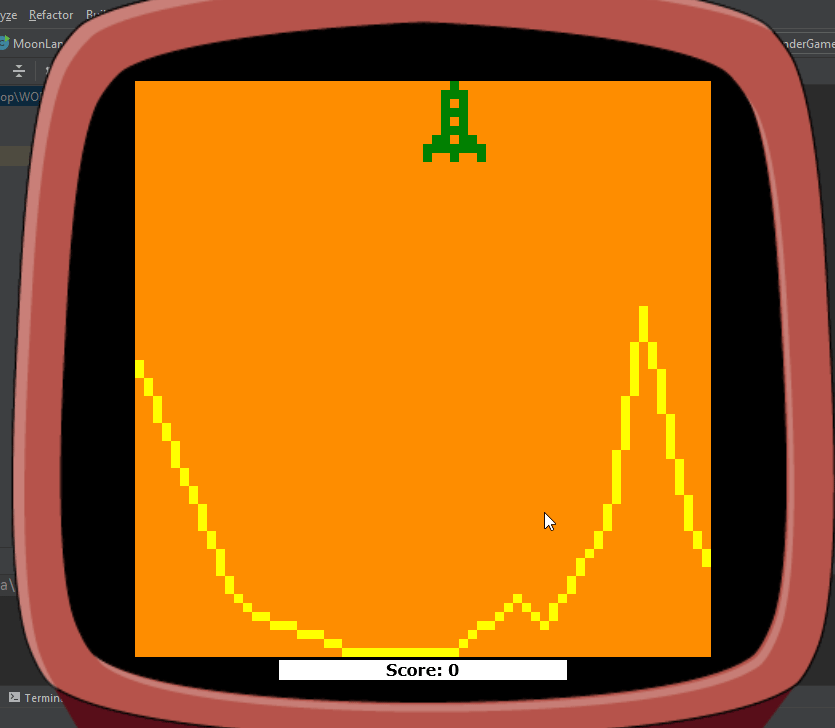

# GameMoonLander
MoonLander - Simple Java Game

## Table of contents
* [General info](#general-info)
* [Technologies](#technologies)
* [Setup](#setup)
* [View](#view)

## General info
MoonLander is a 2D game written in Java.  
The objective of the game is to land the rocker on a smooth surface with a minimum speed and maximum scores.  

## Technologies
Project created with:
* Java: 1.8
* lib: desktop-game-engine.jar
	
## Setup
To run this project, create a simple java application and copy the source code.  
Download the desktop-game-engine.jar.  
Then add the downloaded .jar file to your IDE in the library section.

## View
When the application is started, the surface and rocket appear on the gameboard.
The player goal is to land the rocker using keyboard buttons:
* LEFT arrow (for going left side)
* RIGHT arrow (for going right side)
* UP arrow (for going up)

Be careful not to crash the rocket!    

  
